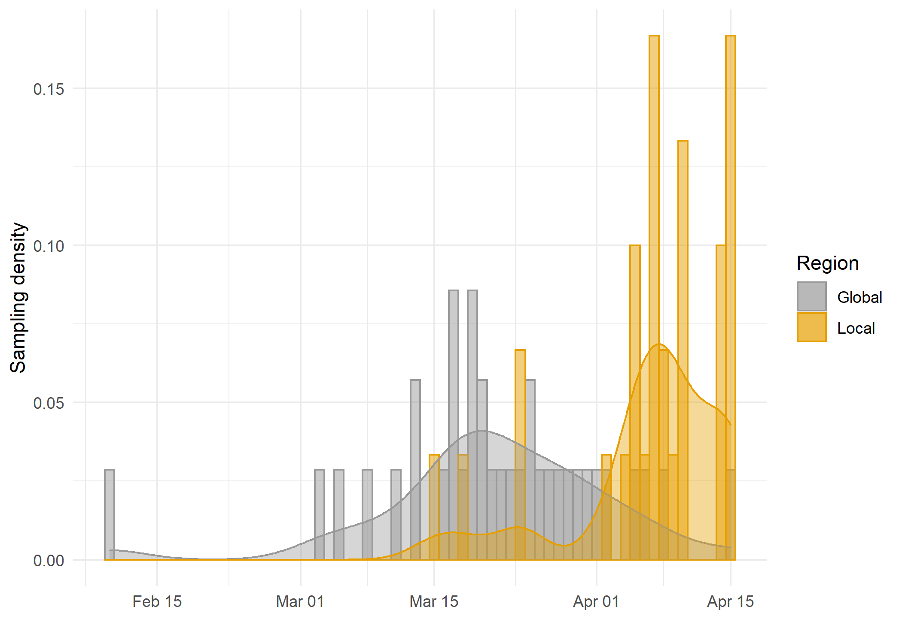
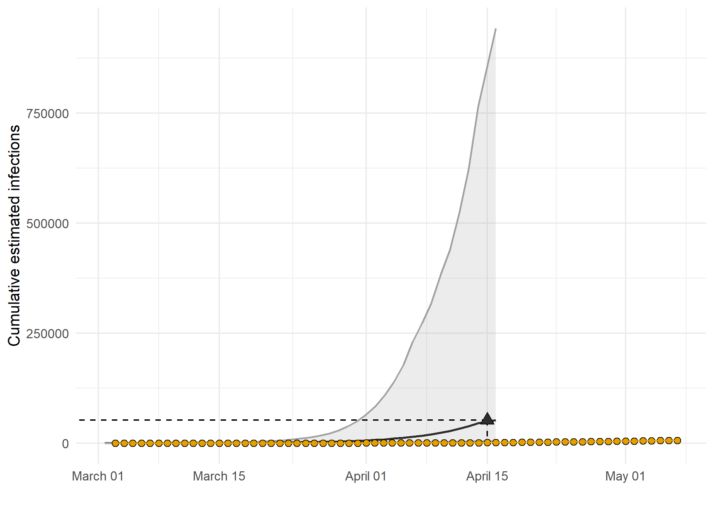
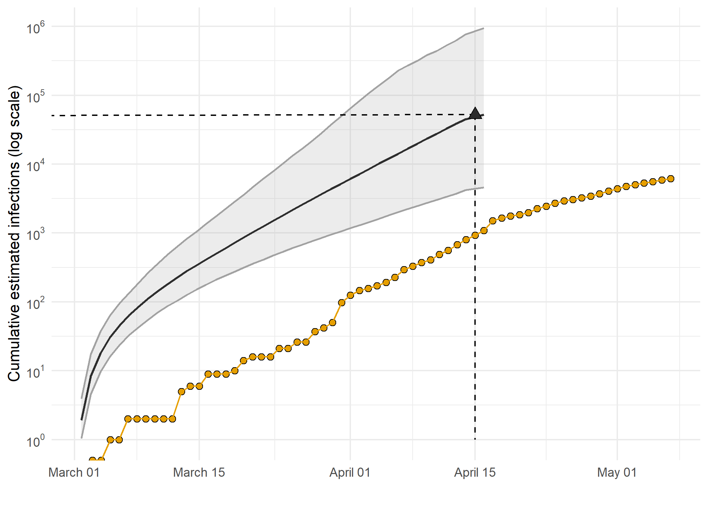
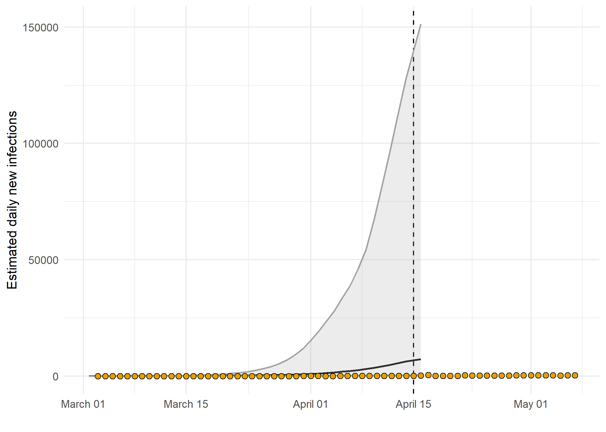
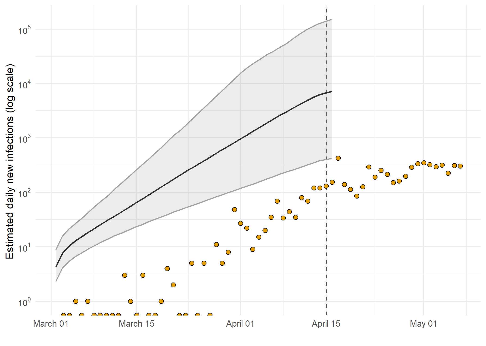
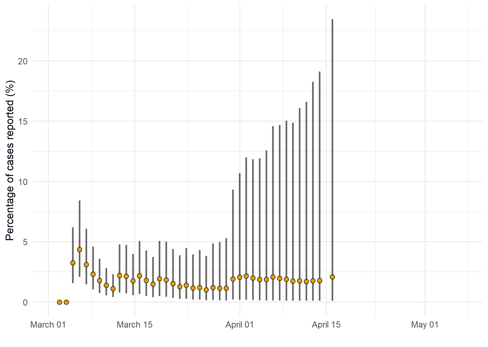
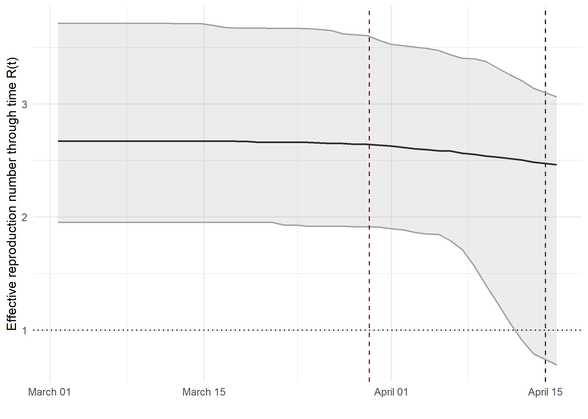
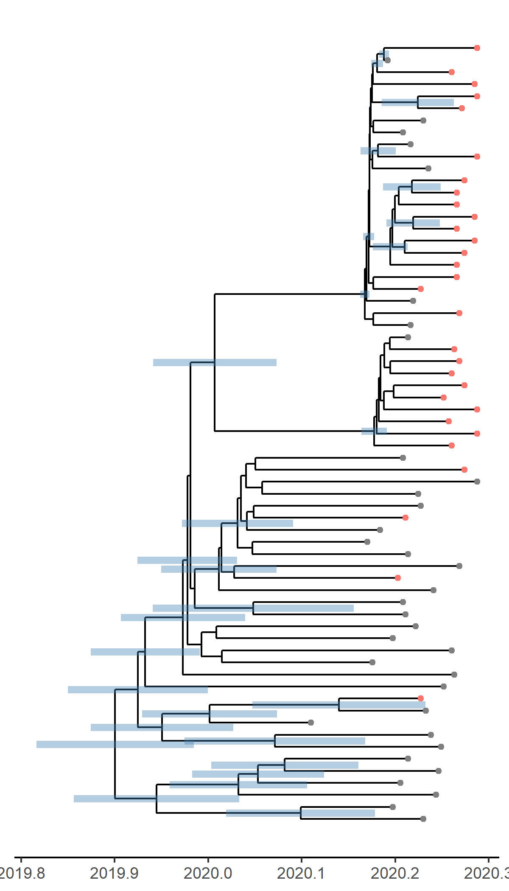

---
title: "Phylodynamic Analysis: STP,: 2020-04-15 "
date: May 21, 2020
---

### Primary author: Olivia Boyd

#### Olivia Boyd, Lily Geidelberg, David Jorgensen, Manon Ragonnet, Igor Siveroni, Erik Volz and the [Imperial College COVID-19 Response Team](http://sarscov2phylodynamics.org/about/)

### Report prepared on 2020-05-21

## Background information  

#### This is analysis is based on : 
  
* **30 whole genomes** sampled from **within STP**
* **35 whole genomes** sampled from outside of **STP**
* Samples within STP were collected between **2020-03-15** and **2020-04-15**

*Figure 1: Sampling distributions over time of number of sequences included within the region versus sequences included from the international reservoir.*

## How many are infected in STP?

*Figure 2: Estimated cumulative infections through time represented by solid black line (median) and 95% CrI (ribbon). Black points represent reported cases in STP. The dashed line indicates the date of last sample in STP in this analysis.*

* Estimated cumulative infections at last sample (2020-04-15): **52134 [4619-942745]** median [95%CI]

* Cumulative confirmed infections reported at 2020-04-15: **929**  

<!-- * Cumulative number of active infections at 2020-04-15:   -->

*Figure 3: Estimated daily  infections through time represented by solid black line (median) and 95% CrI (ribbon). Black points represent reported cases in STP. The dashed line indicates the date of last sample in STP in this analysis.*

*Figure 4: Estimated percentage of daily cases reported in STP. Error bars represent the 95% credible interval.*

*Figure 5: Reproduction number through time. The black vertical dashed line indicates the date of last sample in STP in this analysis. Orange and red dashed lines indicate dates of school closure and general lockdown in STP, respectively. *

Reproduction number at last sample (2020-04-15): **2.46 [0.695-3.06]** median [95% CrI]

## How quickly has the epidemic in STP grown?

<table class="table" style="width: auto !important; ">
<caption>Table 1: Reproduction number, growth rate and doubling times</caption>
 <thead>
  <tr>
   <th style="text-align:center;"> Quantile </th>
   <th style="text-align:center;"> Reproduction number </th>
   <th style="text-align:center;"> Growth rate (per day) </th>
   <th style="text-align:center;"> Doubling time (days) </th>
  </tr>
 </thead>
<tbody>
  <tr>
   <td style="text-align:center;"> 50% </td>
   <td style="text-align:center;"> 2.67 </td>
   <td style="text-align:center;"> 0.160 </td>
   <td style="text-align:center;"> 4.33 </td>
  </tr>
  <tr>
   <td style="text-align:center;"> 2.5% </td>
   <td style="text-align:center;"> 1.97 </td>
   <td style="text-align:center;"> 0.102 </td>
   <td style="text-align:center;"> 2.97 </td>
  </tr>
  <tr>
   <td style="text-align:center;"> 97.5% </td>
   <td style="text-align:center;"> 3.69 </td>
   <td style="text-align:center;"> 0.234 </td>
   <td style="text-align:center;"> 6.78 </td>
  </tr>
</tbody>
</table>

## How has SARS-CoV 2 evolved in STP?

## *[placeholder for ML tree]*

*Figure 6: Maximum likelihood phylogeny with the x-axis representing NT substitutions per site. The colour of the tips corresponds to sampling location; red tips were sampled from within the region, grey tips from outside*

*Figure 7: Time scaled phylogeny co-estimated with epidemiological parameters. The colour of the tips corresponds to location sampling; red tips were sampled from within STP, blue tips from outside.*

##### Molecular clock rate of evolution: **0.000568 [0.000503-0.000743]** median [95% CrI]  

<!-- #### (optional) Number of introductions into STP (someone needs to write code to compute this) -->

## Predicted cumulative infections over next 14 days (assuming exponential growth):

*Figure 8: Cumulative estimated infections. The dashed line indicates the date of last sample in STP in this analysis. The points represent reported cases in STP.*

Based on an estimated growth rate of 0.160 [0.102 - 0.234] median [95% CrI]:  

We estimate cumulative number of infections at last sample (2020-04-15) as: 43586 [3350 - 1255908]

We estimate number of infections at 2020-05-08 (23 days after last sample) as:
1693798 [34222 - 262421754]  

## Methods summary

Details on methods and priors can be [found here](http://whoinfectedwhom.org/seijr0.1.0_methods.pdf).

<table class="table" style="width: auto !important; ">
<caption>Effective sample size of model parameters</caption>
 <thead>
  <tr>
   <th style="text-align:center;"> Statistic </th>
   <th style="text-align:center;"> mean </th>
   <th style="text-align:center;"> ESS </th>
  </tr>
 </thead>
<tbody>
  <tr>
   <td style="text-align:center;"> posterior </td>
   <td style="text-align:center;"> -41670.7317294 </td>
   <td style="text-align:center;"> 347 </td>
  </tr>
  <tr>
   <td style="text-align:center;"> likelihood </td>
   <td style="text-align:center;"> -41598.0376491 </td>
   <td style="text-align:center;"> 561 </td>
  </tr>
  <tr>
   <td style="text-align:center;"> prior </td>
   <td style="text-align:center;"> -72.6940803 </td>
   <td style="text-align:center;"> 72 </td>
  </tr>
  <tr>
   <td style="text-align:center;"> treeLikelihood.algn </td>
   <td style="text-align:center;"> -41598.0376491 </td>
   <td style="text-align:center;"> 561 </td>
  </tr>
  <tr>
   <td style="text-align:center;"> TreeHeight </td>
   <td style="text-align:center;"> 0.3846706 </td>
   <td style="text-align:center;"> 28 </td>
  </tr>
  <tr>
   <td style="text-align:center;"> clockRate </td>
   <td style="text-align:center;"> 0.0005825 </td>
   <td style="text-align:center;"> 39 </td>
  </tr>
  <tr>
   <td style="text-align:center;"> kappa </td>
   <td style="text-align:center;"> 6.4462054 </td>
   <td style="text-align:center;"> 3943 </td>
  </tr>
  <tr>
   <td style="text-align:center;"> PhydynSEIR </td>
   <td style="text-align:center;"> -37.0791997 </td>
   <td style="text-align:center;"> 84 </td>
  </tr>
  <tr>
   <td style="text-align:center;"> seir.E </td>
   <td style="text-align:center;"> 34.4413689 </td>
   <td style="text-align:center;"> 3566 </td>
  </tr>
  <tr>
   <td style="text-align:center;"> seir.S </td>
   <td style="text-align:center;"> 3500402.1158245 </td>
   <td style="text-align:center;"> 100 </td>
  </tr>
  <tr>
   <td style="text-align:center;"> seir.b </td>
   <td style="text-align:center;"> 19.7523603 </td>
   <td style="text-align:center;"> 1555 </td>
  </tr>
  <tr>
   <td style="text-align:center;"> seir.exog </td>
   <td style="text-align:center;"> 0.0332684 </td>
   <td style="text-align:center;"> 326 </td>
  </tr>
  <tr>
   <td style="text-align:center;"> seir.exogGrowthRate </td>
   <td style="text-align:center;"> 26.8870593 </td>
   <td style="text-align:center;"> 25 </td>
  </tr>
  <tr>
   <td style="text-align:center;"> seir.importRate </td>
   <td style="text-align:center;"> 6.0144297 </td>
   <td style="text-align:center;"> 3086 </td>
  </tr>
  <tr>
   <td style="text-align:center;"> seir.p_h </td>
   <td style="text-align:center;"> 0.2192836 </td>
   <td style="text-align:center;"> 6414 </td>
  </tr>
  <tr>
   <td style="text-align:center;"> seir.tau </td>
   <td style="text-align:center;"> 74.0078599 </td>
   <td style="text-align:center;"> 8774 </td>
  </tr>
  <tr>
   <td style="text-align:center;"> freqParameter.1 </td>
   <td style="text-align:center;"> 0.2984297 </td>
   <td style="text-align:center;"> 1601 </td>
  </tr>
  <tr>
   <td style="text-align:center;"> freqParameter.2 </td>
   <td style="text-align:center;"> 0.1829622 </td>
   <td style="text-align:center;"> 1647 </td>
  </tr>
  <tr>
   <td style="text-align:center;"> freqParameter.3 </td>
   <td style="text-align:center;"> 0.1955256 </td>
   <td style="text-align:center;"> 1847 </td>
  </tr>
  <tr>
   <td style="text-align:center;"> freqParameter.4 </td>
   <td style="text-align:center;"> 0.3230825 </td>
   <td style="text-align:center;"> 1643 </td>
  </tr>
  <tr>
   <td style="text-align:center;"> gamma0 </td>
   <td style="text-align:center;"> 73.0000000 </td>
   <td style="text-align:center;"> NaN </td>
  </tr>
  <tr>
   <td style="text-align:center;"> gamma1 </td>
   <td style="text-align:center;"> 121.6670000 </td>
   <td style="text-align:center;"> 4 </td>
  </tr>
</tbody>
</table>

Model version: seijr0.1.1

Report version: 20200521-191851-e2ce584f

## Acknowledgements

This work was supported by the [MRC Centre for Global Infectious Disease Analysis at Imperial College London](https://www.imperial.ac.uk/mrc-global-infectious-disease-analysis).

Sequence data were provided by [GISAID](http://www.epicov.org) and [these laboratories](http://whoinfectedwhom.org/gisaid_cov2020_acknowledgement_table.xls).

