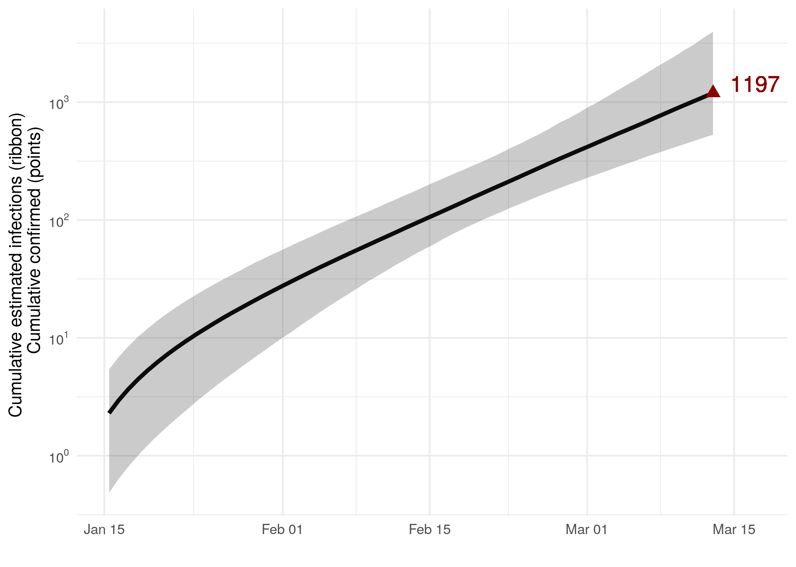
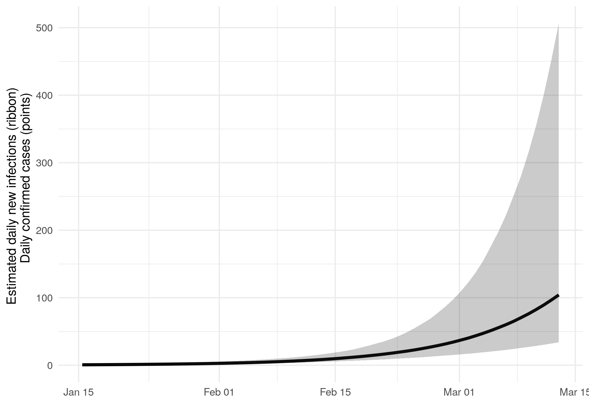
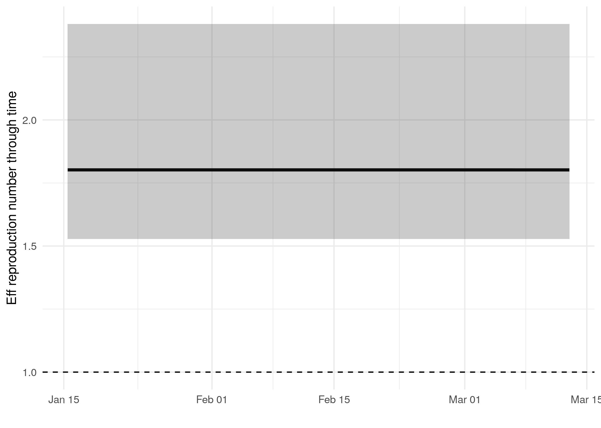
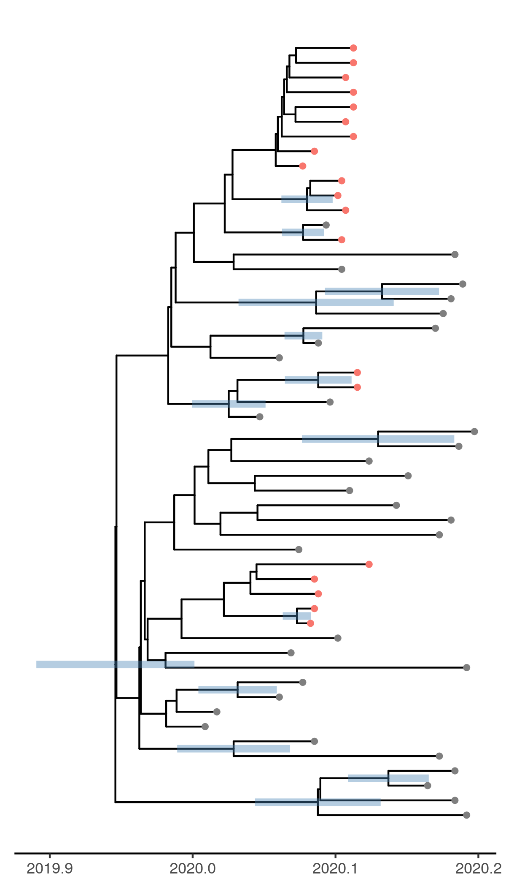

# Phylodynamic analysis: Netherlands, 2020-03-13

### Primary author: David Jorgensen

### Report prepared on 2020-04-05

#### On behalf of the MRC GIDA COVID-19 phylodynamics working group at Imperial College London: Lily Geidelberg, Olivia Boyd, Manon Ragonnet, David Jorgensen,  Igor Siveroni, Erik Volz

## Background information  

#### This is analysis is based on : 
  
* **57 whole genomes** sampled from **within Netherlands**
* **46 whole genomes** sampled from outside of **Netherlands**
* Samples within Netherlands were collected between **2020-01-02** and **2020-03-13**

##### To add: [optional plot of sample distribution through time]

## How many are infected in Netherlands?

{width=90%}

* Estimated cumulative infections at last sample (2020-03-13): **1197 [530-3961]** median [95%CI]

* Cumulative confirmed infections reported at 2020-03-13: 
**NA, NA, NA, NA, NA, NA, NA, NA, NA, NA, NA, NA, NA, NA, NA, NA, NA, NA, NA, NA, NA, NA, NA, NA, NA, NA, NA, NA, NA, NA, NA, NA, NA, NA, NA, NA, NA, NA, NA, NA, NA**  

* Cumulative number of active infections at 2020-03-13:  

{width=90%}

{width=90%}

Reproduction number at last sample (2020-03-13): **1.8 [1.53-2.38]** median [95% CrI]

## How quickly has the epidemic in Netherlands grown?

-------------------------------------------------------------------------------
 Quantile   Reproduction number   Growth rate (per day)   Doubling time (days) 
---------- --------------------- ----------------------- ----------------------
   50%             1.81                  0.0873                   7.94         

   2.5%            1.53                  0.0594                   4.99         

  97.5%             2.4                   0.139                   11.7         
-------------------------------------------------------------------------------

Table: Table 1: Reproduction number, growth rate and doubling times

## How has SARS-CoV 2 evolved in Netherlands?

{width=400px}

##### Molecular clock rate of evolution: **0.00121 [0.000914-0.00154]** median [95% CrI]  

<!-- #### (optional) Number of introductions into Netherlands (someone needs to write code to compute this) -->

## Predicted cumulative infections over next 14 days (assuming exponential growth):

{width=90%}

Predicted reproduction number at 2020-03-27 (14 days after last sample): 
median [95% CrI]
[to add!]

## Methods summary

Details on methods and priors can be [found here](http://whoinfectedwhom.org/seijr0.1.0_methods.pdf).

##### Additional notes about methods: [Insert details about any deviation from the main pipeline, like sample selection, changes to the model etc, where you retrieved other data]

Model version: seijr0.1.0

## Acknowledgements

This work was supported by the [MRC Centre for Global Infectious Disease Analysis at Imperial College London](https://www.imperial.ac.uk/mrc-global-infectious-disease-analysis).

Sequence data were provided by [GISAID](http://www.epicov.org) and [these laboratories](http://whoinfectedwhom.org/gisaid_cov2020_acknowledgement_table.xls).

