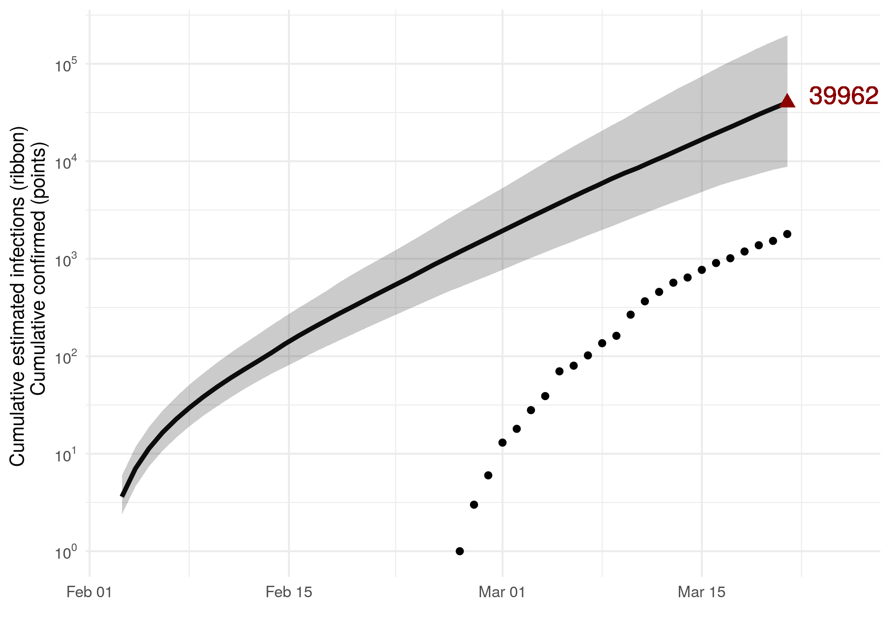
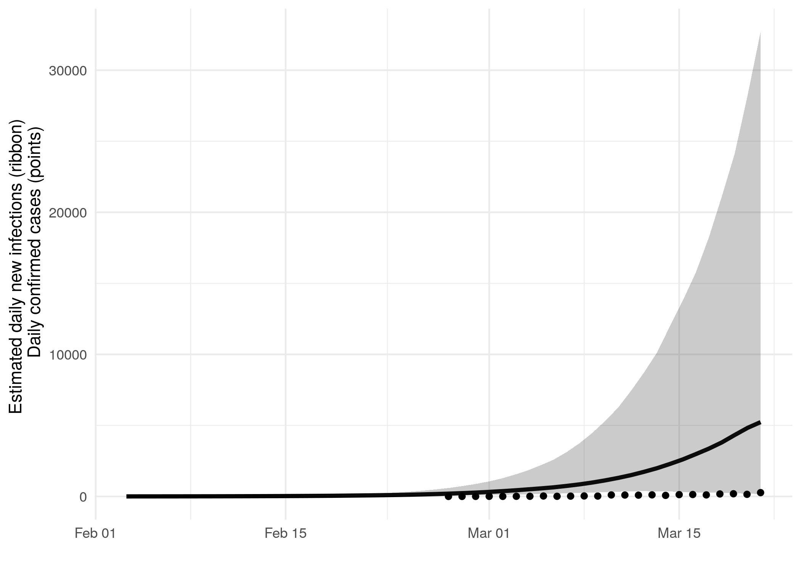
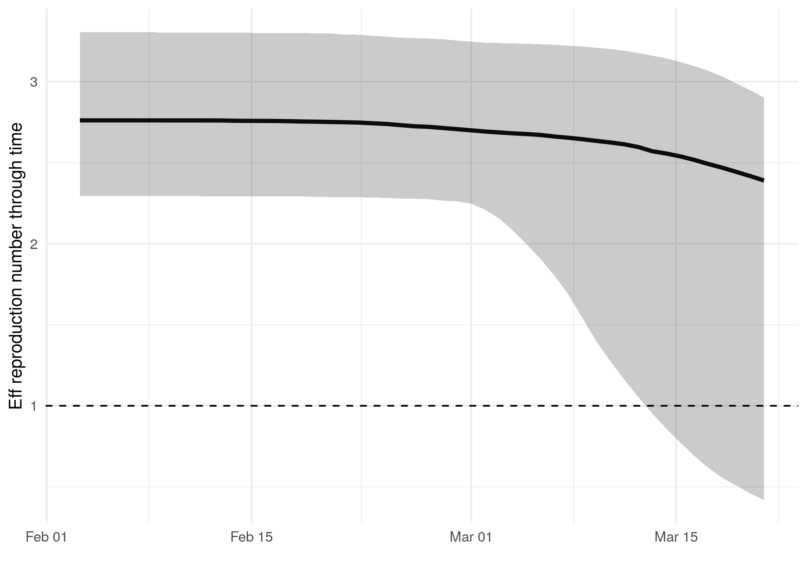

```{r titleparms, echo = F, include = F }
doc.type <- knitr::opts_knit$get('rmarkdown.pandoc.to')
info <- readRDS("info_for_P2.rds")
posterior_model_parameters_for_P2 <- read.csv("posterior_model_parameters_for_P2.csv")

last_tip <- info$last_tip
first_tip <- info$first_tip
n_genomes_Il <- info$n_genomes_Il
n_genomes_exog <- info$n_genomes_exog
location <- info$location
clock_rate <- posterior_model_parameters_for_P2$clockRate


primary_authors <- info$author
pres_author <- "Lily Geidelberg, Olivia Boyd, Manon Ragonnet, David Jorgensen,  Igor Siveroni, Erik Volz"
pres_date <- Sys.Date()


```


# Phylodynamic analysis: `r str_to_title(location, locale = "en")`, `r last_tip`


### Primary author: `r primary_authors`

### Report prepared on `r pres_date`

#### On behalf of the MRC GIDA COVID-19 phylodynamics working group at Imperial College London: `r pres_author`

```{r arguments from orderly , echo = F, include = F}

r_table <- read.csv("R_and_growth_rate.csv")


r_table$Growth.rate..per.day. <- formatC(signif(r_table$Growth.rate..per.day.,digits=3), digits=3,format="fg", flag="#")


colnames(r_table) <- c("Quantile", "Reproduction number", "Growth rate (per day)", "Doubling time (days)")


```


## Background information  


#### This is analysis is based on : 
  
* **`r n_genomes_Il` whole genomes** sampled from **within `r str_to_title(location, locale = "en")`**
* **`r n_genomes_exog` whole genomes** sampled from outside of **`r str_to_title(location, locale = "en")`**
* Samples within `r str_to_title(location, locale = "en")` were collected between **`r first_tip`** and **`r last_tip`**


##### To add: [optional plot of sample distribution through time]


## How many are infected in `r str_to_title(location, locale = "en")`?


```{r Cumulative estimated infections through time, fig.cap="Figure 1: Cumulative estimated infections through time. Points represent reported cases in the region.",  out.width = "90%",echo = F}

```

* Estimated cumulative infections at last sample (`r last_tip`): **`r info$infections_at_last_tip` [`r info$infections_at_last_tip_lower`-`r info$infections_at_last_tip_upper`]** median [95%CI]

* Cumulative confirmed infections reported at `r last_tip`: 
**`r info$confirmed_infections_last_tip`**  

* Cumulative number of active infections at `r last_tip`:  


```{r daily estimated infections through time, fig.cap="Figure 2: Daily estimated infections through time. Points represent reported cases in the region.",  out.width = "90%",  echo = F}

```


```{r Rt, fig.cap="Figure 3: Reproduction number through time",  out.width = "90%",  echo = F}

```


Reproduction number at last sample (`r last_tip`): **`r info$Rt_at_last_tip` [`r info$Rt_at_last_tip_lower`-`r info$Rt_at_last_tip_upper`]** median [95% CrI]


## How quickly has the epidemic in `r str_to_title(location, locale = "en")` grown?


```{r table_proportion_age,  echo = F}

# xtable(r_table)

if (doc.type == "docx") { pander::pander(r_table, caption ="Table 1: Reproduction number, growth rate and doubling times") } else { 
r_table %>%
  kable(caption = "Table 1: Reproduction number, growth rate and doubling times", align = "cccc") %>%
  kable_styling( full_width = F, position = "left")
}


```


## How has SARS-CoV 2 evolved in `r str_to_title(location, locale = "en")`?


```{r mcc_tree, fig.cap="Figure 4: Time scaled phylogeny co-estimated with epidemiological parameters. The colour of the tips corresponds to location sampling; red tips were sampled from within the region, blue tips from outside",  out.width = "400px",echo = F}
knitr::include_graphics("mcc.png")
```


##### Molecular clock rate of evolution: **`r format(median(clock_rate), digits=3)` [`r format(quantile(clock_rate, c(0.025)), digits=3)`-`r format(quantile(clock_rate, c(0.975)), digits=3)`]** median [95% CrI]  

<!-- #### (optional) Number of introductions into `r str_to_title(location, locale = "en")` (someone needs to write code to compute this) -->


## Predicted cumulative infections over next 14 days (assuming exponential growth):


```{r predicted infections through time, fig.cap="Figure 5: Cumulative estimated infections. The dashed line indicates the date of last sample in analysis. The points represent reported cases in the region.",  out.width = "90%",  echo = F}
knitr::include_graphics("cumu_inf_exp_model.png")
```

Predicted reproduction number at `r info$dates[2]` (`r as.integer(as.Date(info$dates[2])- as.Date(info$last_tip))` days after last sample): 
median [95% CrI]
[to add!]


## Methods summary


Details on methods and priors can be [found here](http://whoinfectedwhom.org/seijr0.1.0_methods.pdf).

##### Additional notes about methods: [Insert details about any deviation from the main pipeline, like sample selection, changes to the model etc, where you retrieved other data]

Model version: `r info$model_version`


## Acknowledgements

This work was supported by the [MRC Centre for Global Infectious Disease Analysis at Imperial College London](https://www.imperial.ac.uk/mrc-global-infectious-disease-analysis).

Sequence data were provided by [GISAID](http://www.epicov.org) and [these laboratories](http://whoinfectedwhom.org/gisaid_cov2020_acknowledgement_table.xls).


