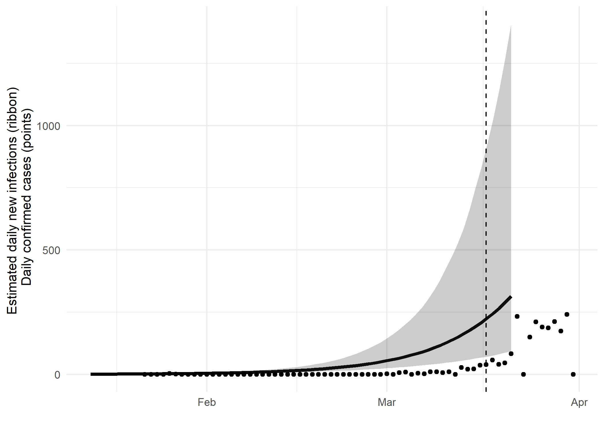

# Location: Nsw
# Most recent sample: 2020-03-17

### Primary author: David Jorgensen

### Report prepared on 2020-04-07

#### On behalf of the MRC GIDA COVID-19 phylodynamics working group at Imperial College London: Lily Geidelberg, Olivia Boyd, Manon Ragonnet, David Jorgensen,  Igor Siveroni, Erik Volz

## Background information  

#### This is analysis is based on : 
  
* **43 whole genomes** sampled from **within Nsw**
* **62 whole genomes** sampled from outside of **Nsw**
* Samples within Nsw were collected between **2020-01-18** and **2020-03-17**

##### To add: [optional plot of sample distribution through time]

## How many are infected in Nsw?

*Figure 1: Cumulative estimated infections through time. Points represent reported cases in Nsw. The dashed line indicates the date of last sample in Nsw in this analysis.*

* Estimated cumulative infections at last sample (2020-03-17): **3604 [1374-12429]** median [95%CI]

* Cumulative confirmed infections reported at 2020-03-17: 
**210**  

* Cumulative number of active infections at 2020-03-17:  

*Figure 2: Daily estimated infections through time. Points represent reported cases in Nsw. The dashed line indicates the date of last sample in Nsw in this analysis.*

*Figure 3: Reproduction number through time. The dashed line indicates the date of last sample in Nsw in this analysis.*

Reproduction number at last sample (2020-03-17): **1.8 [1.56-2.17]** median [95% CrI]

## How quickly has the epidemic in Nsw grown?

<table class="table" style="width: auto !important; ">
<caption>Table 1: Reproduction number, growth rate and doubling times</caption>
 <thead>
  <tr>
   <th style="text-align:center;"> Quantile </th>
   <th style="text-align:center;"> Reproduction number </th>
   <th style="text-align:center;"> Growth rate (per day) </th>
   <th style="text-align:center;"> Doubling time (days) </th>
  </tr>
 </thead>
<tbody>
  <tr>
   <td style="text-align:center;"> 50% </td>
   <td style="text-align:center;"> 1.81 </td>
   <td style="text-align:center;"> 0.0875 </td>
   <td style="text-align:center;"> 7.92 </td>
  </tr>
  <tr>
   <td style="text-align:center;"> 2.5% </td>
   <td style="text-align:center;"> 1.56 </td>
   <td style="text-align:center;"> 0.0629 </td>
   <td style="text-align:center;"> 5.69 </td>
  </tr>
  <tr>
   <td style="text-align:center;"> 97.5% </td>
   <td style="text-align:center;"> 2.20 </td>
   <td style="text-align:center;"> 0.122 </td>
   <td style="text-align:center;"> 11.00 </td>
  </tr>
</tbody>
</table>

## How has SARS-CoV 2 evolved in Nsw?

*Figure 4: Time scaled phylogeny co-estimated with epidemiological parameters. The colour of the tips corresponds to location sampling; red tips were sampled from within Nsw, blue tips from outside.*

##### Molecular clock rate of evolution: **0.00168 [0.00131-0.0021]** median [95% CrI]  

<!-- #### (optional) Number of introductions into Nsw (someone needs to write code to compute this) -->

## Predicted cumulative infections over next 14 days (assuming exponential growth):

*Figure 5: Cumulative estimated infections. The dashed line indicates the date of last sample in Nsw in this analysis. The points represent reported cases in Nsw.*

Based on an estimated growth rate of 0.0875 [0.0629 - 0.122] median [95% CrI]:  

We estimate cumulative number of infections at last sample (2020-03-17) as: 1063 [138 - 12582]

We estimate number of infections at 2020-03-31 (14 days after last sample) as:
3604 [395 - 68142]  

## Methods summary

Details on methods and priors can be [found here](http://whoinfectedwhom.org/seijr0.1.0_methods.pdf).

Model version: seijr0.1.0

Report version: 20200407-223937-ce202008

## Acknowledgements

This work was supported by the [MRC Centre for Global Infectious Disease Analysis at Imperial College London](https://www.imperial.ac.uk/mrc-global-infectious-disease-analysis).

Sequence data were provided by [GISAID](http://www.epicov.org) and [these laboratories](http://whoinfectedwhom.org/gisaid_cov2020_acknowledgement_table.xls).

