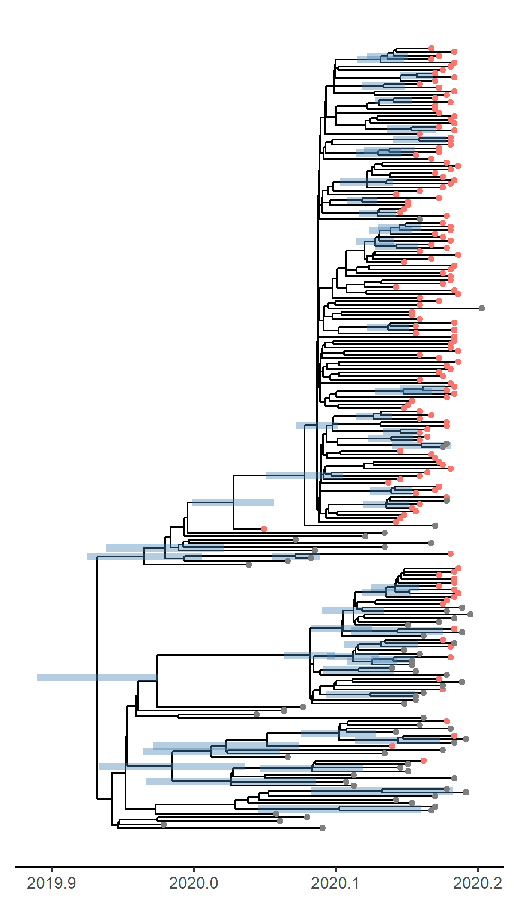
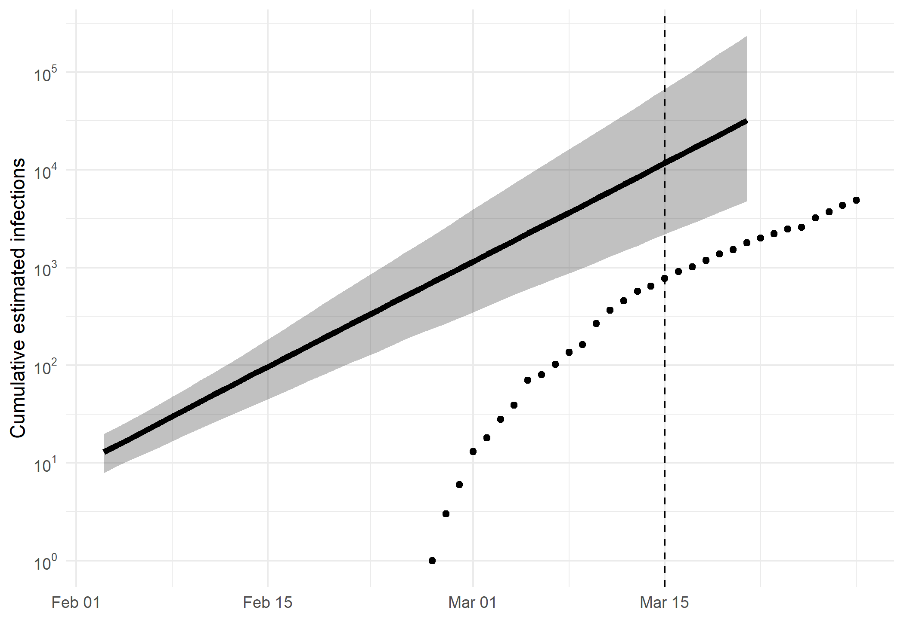

---
title: "Phylodynamic Analysis: Washington,: 2020-03-15 "
date: April 09, 2020
---

### Primary author: Manon Ragonnet

### Report prepared on 2020-04-09

#### On behalf of the MRC GIDA COVID-19 phylodynamics working group at Imperial College London: Lily Geidelberg, Olivia Boyd, Manon Ragonnet, David Jorgensen,  Igor Siveroni, Erik Volz

## Background information  

#### This is analysis is based on : 
  
* **152 whole genomes** sampled from **within Washington**
* **68 whole genomes** sampled from outside of **Washington**
* Samples within Washington were collected between **2020-02-26** and **2020-03-15**

<!-- ##### To add: [optional plot of sample distribution through time] -->

## How many are infected in Washington?

*Figure 1: Cumulative estimated infections through time. Points represent reported cases in Washington. The dashed line indicates the date of last sample in Washington in this analysis.*

* Estimated cumulative infections at last sample (2020-03-15): **39962 [8790-195314]** median [95%CI]

* Cumulative confirmed infections reported at 2020-03-15: **769**  

<!-- * Cumulative number of active infections at 2020-03-15:   -->

*Figure 2: Daily estimated infections through time. Points represent reported cases in Washington. The dashed line indicates the date of last sample in Washington in this analysis.*

*Figure 3: Reproduction number through time. The dashed line indicates the date of last sample in Washington in this analysis.*

Reproduction number at last sample (2020-03-15): **2.39 [0.419-2.9]** median [95% CrI]

## How quickly has the epidemic in Washington grown?

<table class="table" style="width: auto !important; ">
<caption>Table 1: Reproduction number, growth rate and doubling times</caption>
 <thead>
  <tr>
   <th style="text-align:center;"> Quantile </th>
   <th style="text-align:center;"> Reproduction number </th>
   <th style="text-align:center;"> Growth rate (per day) </th>
   <th style="text-align:center;"> Doubling time (days) </th>
  </tr>
 </thead>
<tbody>
  <tr>
   <td style="text-align:center;"> 50% </td>
   <td style="text-align:center;"> 2.76 </td>
   <td style="text-align:center;"> 0.167 </td>
   <td style="text-align:center;"> 4.15 </td>
  </tr>
  <tr>
   <td style="text-align:center;"> 2.5% </td>
   <td style="text-align:center;"> 2.29 </td>
   <td style="text-align:center;"> 0.130 </td>
   <td style="text-align:center;"> 3.37 </td>
  </tr>
  <tr>
   <td style="text-align:center;"> 97.5% </td>
   <td style="text-align:center;"> 3.28 </td>
   <td style="text-align:center;"> 0.206 </td>
   <td style="text-align:center;"> 5.33 </td>
  </tr>
</tbody>
</table>

## How has SARS-CoV 2 evolved in Washington?

*Figure 4: Time scaled phylogeny co-estimated with epidemiological parameters. The colour of the tips corresponds to location sampling; red tips were sampled from within Washington, blue tips from outside.*

##### Molecular clock rate of evolution: **0.00161 [0.00121-0.0022]** median [95% CrI]  

<!-- #### (optional) Number of introductions into Washington (someone needs to write code to compute this) -->

## Predicted cumulative infections over next 14 days (assuming exponential growth):

*Figure 5: Cumulative estimated infections. The dashed line indicates the date of last sample in Washington in this analysis. The points represent reported cases in Washington.*

Based on an estimated growth rate of 0.167 [0.130 - 0.206] median [95% CrI]:  

We estimate cumulative number of infections at last sample (2020-03-15) as: 11733 [2192 - 67438]

We estimate number of infections at 2020-03-21 (6 days after last sample) as:
32153 [4777 - 234950]  

## Methods summary

Details on methods and priors can be [found here](http://whoinfectedwhom.org/seijr0.1.0_methods.pdf).

Model version: seijr0.0.0

Report version: 20200409-105438-beb51a4d

## Acknowledgements

This work was supported by the [MRC Centre for Global Infectious Disease Analysis at Imperial College London](https://www.imperial.ac.uk/mrc-global-infectious-disease-analysis).

Sequence data were provided by [GISAID](http://www.epicov.org) and [these laboratories](http://whoinfectedwhom.org/gisaid_cov2020_acknowledgement_table.xls).

